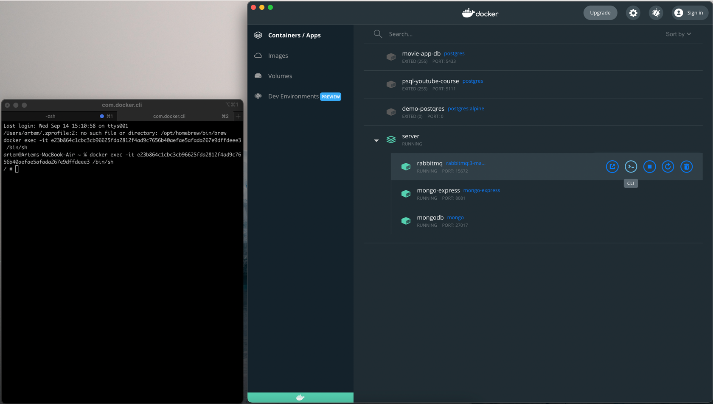
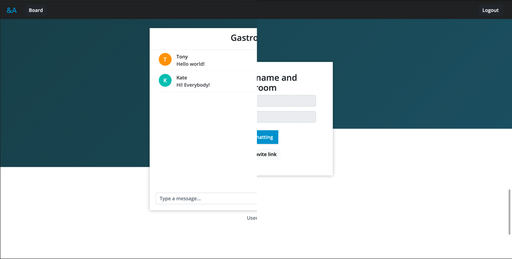

# &A

Chat application is built on Spring and MongoDB


### Installation

To get started you need to have docker installed on your machine

Then, you can run .yaml files not only directly in IDE, but also in terminal

```bash
  docker-compose -f docker-mongoDB.yaml up
```
```bash
  docker-compose -f docker-rabbitMQ.yaml up
```
Don't forget to enable stomp plugin in RabbitMQ
(You could use CLI in Docker to enable it)

```bash
  rabbitmq-plugins enable rabbitmq_stomp
```



The server runs on 9091 port, but if have any conflicts, you can change it

```
#application.properties
server.port=9091

#main.js
let port = 9091;
```

## Run it

The project has a Bootstrap class, 
which  includes all pre-data you need to test the application,
so you could avoid of registration the rooms or users to work with.

```java
@Component
public class Bootstrap {
  ...
}
```

After running, you can see Login page which is asking for E-mail and Password.
Thanks to Bootstrap class, we have users already in DB.

#### Database

| Username | Passwords   | Email               | Role |
|:---------|:------------|:--------------------|:-----|
| `Tony`   | `PassJava1` | tonyPizza@gmail.com | Admin|
| `Kate`   | `PassJava2` | kate@gmail.com      | User |

| Title  | Topic     | Password |
|:-------|:----------|:---------|
| `Gastronomy` | `Cooking` | 123      |

### Congratulations

Congratulations! You are inside the app 🎉


### 🚀 Before
"I would recommend you to open different browsers (Or open second page in incognito mode) 
and login with different users and enter to the same chatroom, 
so then you can feel better how it works"

###  Start
You are already connected to the chatroom, 
let's enter there and try to write down anything to the chat.



As you are admin, you have access to the dashboard 
where you can control and see what people have written before.


Furthermore, you are able to ban users or to unban them.
In the case of it the user would see the next if he tries to enter to any endpoints.
GlobalHandler can catch the error and redirect to the page with error description


## Features

- Chatrooms secured with passwords
- History of chatrooms are saved in DB
- If you are connecting via the link, you don't need to provide password
- If the user is not owner, so the room will be erased locally on its profile
- Admin board, it provides all info about their messages
- Banning system


## 🛠 Skills
Spring (Security, Data...), Maven, Thymeleaf, JS, MongoDB and RabbitMQ